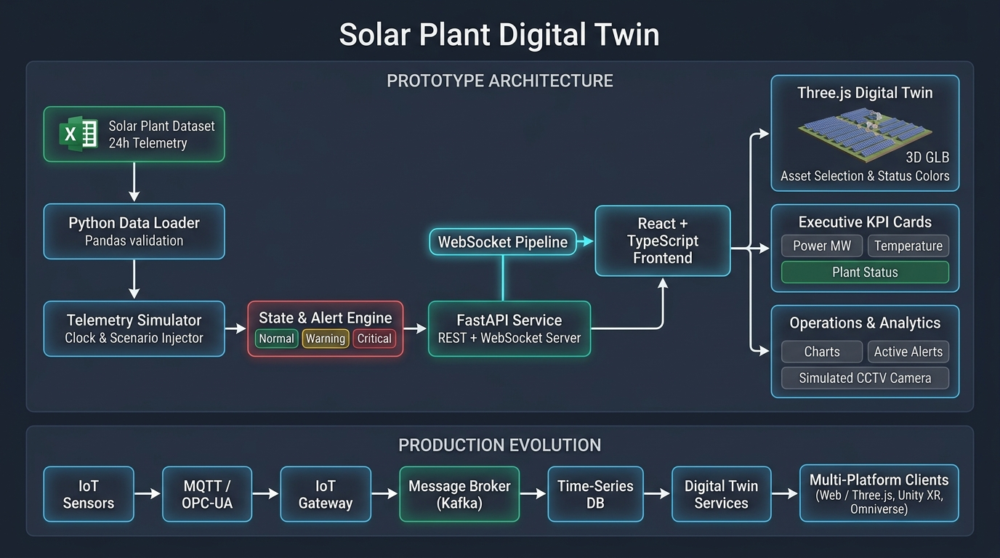

# Solar Plant Digital Twin

A browser-based Solar Plant Digital Twin prototype developed as a technical assessment for Dezzex Technologies.

The system combines simulated IoT telemetry, a real-time WebSocket pipeline, a browser-native Three.js digital twin, operational dashboards, alerts, AI-assisted operational insights, and a simulated plant camera.

---

## 1. Overview

The prototype represents a solar plant as a set of identifiable physical assets.

The current prototype contains six solar assets:

- ARRAY_01 — Carport / Rear Row
- ARRAY_02 — Carport / Center Row
- ARRAY_03 — Carport / Front Row
- ARRAY_04 — Main Building Rooftop
- ARRAY_05 — Annex / Front-Right
- ARRAY_06 — Upper Facility Rooftop

Each physical 3D asset is mapped directly to an `asset_id` used by the telemetry system.

The system demonstrates how simulated telemetry can drive the state of a browser-based digital twin in real time.

---

## 2. Architecture



```text
                    Solar Plant Dataset
                    Excel Workbook
                          |
                          v
                 Python Data Loader
                          |
                          v
                 Telemetry Simulator
                          |
                          v
                Scenario Injection
                          |
                          v
              State / Alert Evaluation
                          |
                          v
                       FastAPI
                    REST + WebSocket
                          |
                          v
                React + TypeScript
                          |
          +---------------+---------------+
          |               |               |
          v               v               v
      Three.js       Executive        Operations
     Digital Twin     Dashboard         Alerts
          |               |               |
          +---------------+---------------+
                          |
                          v
                 Operational Insight
                          |
                          v
                 Simulated Camera
```

---

## 3. Technology Stack

### Frontend
- React
- TypeScript
- Vite
- Three.js
- Recharts

### Backend
- Python
- FastAPI
- Pydantic
- Pandas
- WebSocket

### Data
- Excel telemetry dataset
- 24-hour simulated telemetry
- 5-minute source intervals

---

## 4. Data Source

The supplied solar plant dataset contains:

- 6 solar arrays
- 24 hours of telemetry
- 5-minute intervals
- Asset-level telemetry
- Plant-level aggregated telemetry

### Asset telemetry fields
- `timestamp`
- `asset_id`
- `asset_type`
- `capacity_kw`
- `power_kw`
- `panel_temperature_c`
- `ambient_temperature_c`
- `voltage_v`
- `current_a`
- `efficiency_pct`
- `status`

The original dataset is treated as immutable.

The simulator adds demonstration scenarios without modifying the source workbook.

---

## 5. Real-Time Telemetry Flow

The simulator progresses through the supplied telemetry records and publishes the current plant state through a shared WebSocket connection.

```text
Excel
  ↓
Pandas
  ↓
Telemetry records
  ↓
Simulator
  ↓
State evaluation
  ↓
WebSocket
  ↓
React state
```

The frontend does not independently determine the operational meaning of telemetry.

The backend evaluates asset state and publishes the resulting state to the frontend.

---

## 6. Asset State Rules

Panel temperature is used for the primary thermal state evaluation.

```text
Temperature < 70°C
    → NORMAL

70°C ≤ Temperature < 75°C
    → WARNING

Temperature ≥ 75°C
    → CRITICAL
```

Plant status is derived from the asset states:

```text
Any CRITICAL asset
    → Plant CRITICAL

Otherwise, any WARNING asset
    → Plant WARNING

Otherwise
    → Plant NORMAL
```

---

## 7. Demonstration Scenario

A deterministic scenario is included for demonstration purposes.

The affected asset is:

**`ARRAY_04`**

which corresponds to:

**Main Building Rooftop**

The scenario demonstrates:

```text
NORMAL
   ↓
WARNING
   ↓
CRITICAL
```

with the thermal values progressing to the configured demonstration thresholds.

This allows the evaluator to observe the complete operational workflow without requiring physical IoT hardware.

---

## 8. 3D Digital Twin

The browser-based digital twin is implemented using Three.js.

The supplied GLB model contains the six solar assets.

Each asset is mapped using its GLB object name:

- `array_01` → `ARRAY_01`
- `array_02` → `ARRAY_02`
- `array_03` → `ARRAY_03`
- `array_04` → `ARRAY_04`
- `array_05` → `ARRAY_05`
- `array_06` → `ARRAY_06`

The corresponding Three.js object receives:

```javascript
object.userData.assetId = "ARRAY_04";
```

This creates the connection between the physical representation and the telemetry model.

---

## 9. 3D Interaction

The digital twin supports:

- Orbit
- Zoom
- Pan
- Asset selection
- Asset highlighting
- Asset status visualization

Selecting a solar asset displays its operational information including:

- Power
- Temperature
- Efficiency
- Capacity
- Voltage
- Current
- Status
- Physical location

---

## 10. Real-Time 3D State

Telemetry state is reflected directly in the 3D model.

```text
NORMAL
    ↓
Normal appearance

WARNING
    ↓
Warning visual state

CRITICAL
    ↓
Critical visual state
```

This allows the operator to visually locate an abnormal asset within the plant.

---

## 11. Executive Dashboard

The dashboard provides plant-level operational KPIs:

- Current Power
- Average Panel Temperature
- Maximum Panel Temperature
- Plant Status

Additional operational information includes:

- Selected asset telemetry
- Power history
- Temperature history
- Active alerts
- Operational insights

---

## 12. Alerts

Alerts are generated by the backend state and alert services.

Each alert contains:

- Asset
- Timestamp
- Severity
- Condition
- Message
- Recommendation

Example:

```text
CRITICAL

Main Building Rooftop

ARRAY_04 panel temperature has reached 77.0°C.

Inspect the affected array and check for
abnormal thermal conditions.
```

Alert generation is state-transition based to avoid continuously generating duplicate alerts for the same condition.

---

## 13. AI Operational Insight

The prototype does not train or deploy an AI model.

Instead, deterministic operational rules detect the condition and an explanation layer presents an operational insight.

Example:

```text
ARRAY_04 panel temperature is above
the warning threshold.

Potential impact:
Elevated panel temperature may reduce
generation efficiency.

Recommended action:
Monitor the array and inspect temperature trends.
```

The architecture intentionally separates anomaly detection from explanation so that a future ML/AI service can replace or augment the deterministic approach.

---

## 14. Simulated Plant Camera

The prototype includes a simulated plant surveillance view:

```text
CAM-01
SOLAR FIELD
SIMULATED FEED
```

The camera provides a fixed plant overview representing a CCTV-style operational view.

---

## 15. API

The backend exposes:

- `GET /health`
- `GET /assets`
- `GET /assets/{asset_id}`
- `GET /telemetry/latest`
- `GET /telemetry/{asset_id}`
- `GET /telemetry/plant/latest`
- `GET /telemetry/plant`
- `GET /alerts`
- `WS /ws/telemetry`

FastAPI documentation is available at:

`http://127.0.0.1:8000/docs`

---

## 16. Running the Project

### Backend

From the project root:

```powershell
.\.venv\Scripts\Activate.ps1
```

Then:

```powershell
uvicorn backend.app.main:app --reload
```

Backend:
`http://127.0.0.1:8000`

API documentation:
`http://127.0.0.1:8000/docs`

### Frontend

Open another terminal:

```powershell
cd frontend
npm run dev
```

Frontend:
`http://localhost:5173`

---

## 17. Project Structure

```text
solar-digital-twin/
│
├── backend/
│   ├── app/
│   │   ├── api/
│   │   ├── models/
│   │   ├── services/
│   │   └── main.py
│   │
│   └── simulator/
│       ├── data_loader.py
│       ├── simulator.py
│       ├── scenario.py
│       ├── scenario_injector.py
│       └── ...
│
├── frontend/
│   └── src/
│       ├── components/
│       ├── dashboard/
│       ├── twin/
│       ├── alerts/
│       ├── camera/
│       ├── telemetry/
│       └── services/
│
├── data/
│   └── solar_plant_sample_data.xlsx
│
├── docs/
│
└── README.md
```

---

## 18. Scalability

The prototype intentionally separates the visualization layer from the telemetry source.

The current prototype is:

```text
Excel
 ↓
Python Simulator
 ↓
FastAPI
 ↓
WebSocket
 ↓
React / Three.js
```

A production architecture can replace the simulated data source:

```text
Physical IoT Sensors
        ↓
MQTT / OPC-UA
        ↓
IoT Gateway
        ↓
Message Broker
        ↓
Telemetry Platform
        ↓
Time-Series Database
        ↓
Digital Twin Services
        ↓
Web / Unity / Omniverse Clients
```

This allows the browser visualization to remain independent of the underlying telemetry source.

---

## 19. Technology Decisions

| Technology | Purpose |
| :--- | :--- |
| **React** | Web application UI |
| **TypeScript** | Type-safe frontend development |
| **Three.js** | Browser-based 3D digital twin |
| **FastAPI** | Backend REST/WebSocket API |
| **Python** | IoT simulation / data processing |
| **Pandas** | Dataset ingestion |
| **WebSocket** | Real-time telemetry |
| **GLTF / GLB** | 3D asset delivery |
| **Recharts** | Operational trend visualization |
| **Rule engine** | Deterministic alert detection |

*(Detailed design rationales are documented in [docs/technology-decisions.md](docs/technology-decisions.md))*

### Why Three.js?
Three.js provides a browser-native WebGL/WebGPU-oriented 3D experience without requiring a separate game engine runtime.

This makes it suitable for an accessible web-based digital twin prototype.

### Why FastAPI?
FastAPI provides a lightweight Python API layer with native asynchronous capabilities and WebSocket support.

It also integrates naturally with Pandas-based telemetry processing.

### Why WebSocket?
Digital twin telemetry is event-oriented and continuously changing.

WebSocket allows the backend to push telemetry updates to connected clients without requiring continuous HTTP polling.

### Why not Unity for the browser prototype?
Unity is well suited for immersive simulation, XR, and dedicated 3D applications.

For this assessment, the primary requirement is a browser-based digital twin, so Three.js keeps the prototype directly accessible through a web browser.

Unity can remain a future immersive/XR client.

### Future enterprise visualization
For larger enterprise digital-twin ecosystems, OpenUSD and NVIDIA Omniverse can provide a foundation for interoperable 3D scenes and simulation workflows.

---

## 20. Prototype Limitations

This prototype uses:

- Simulated telemetry
- Excel as the source dataset
- Deterministic thermal rules
- Simulated camera imagery
- Rule-based operational explanations

It does not represent a production IoT deployment.

The architecture is designed so these components can later be replaced by live telemetry infrastructure, production anomaly detection, real camera streams, and enterprise digital-twin services.

---

## 21. Demonstration Flow

The intended demonstration sequence is:

1. Open the Solar Plant Digital Twin.
2. Show the live connection indicator.
3. Show current plant KPIs.
4. Navigate the 3D solar plant.
5. Select a solar asset.
6. Show its telemetry.
7. Allow the simulator to progress.
8. `ARRAY_04` enters WARNING.
9. The corresponding 3D asset changes state.
10. The plant status changes.
11. The alert appears.
12. `ARRAY_04` reaches CRITICAL.
13. The critical 3D state appears.
14. Show the operational insight.
15. Show the simulated plant camera.
16. Explain the production scalability path.

---

## 22. Conclusion

This prototype demonstrates the complete path from simulated IoT telemetry to a browser-based operational digital twin.

The core design principle is:

> The 3D model represents the physical asset, while the telemetry system represents its operational state.

By maintaining an explicit `asset_id` mapping between these two layers, the same architecture can evolve from simulated data toward live industrial telemetry.
